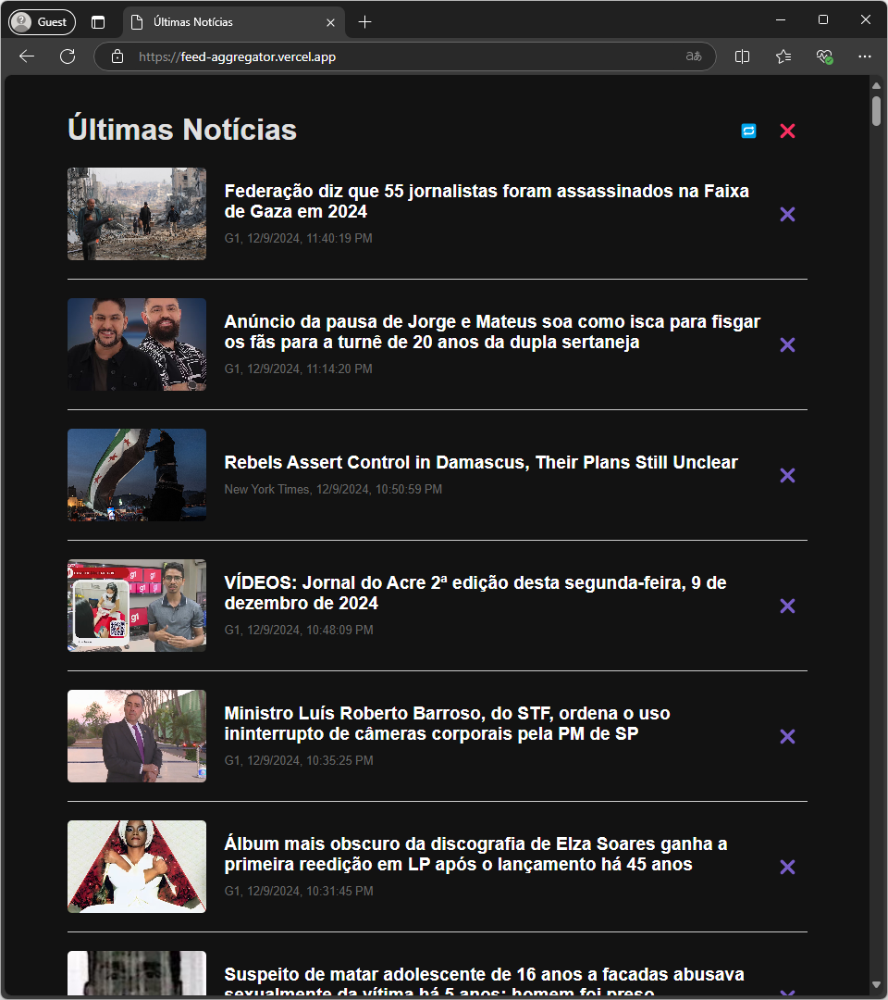

# Feed Aggregator

Feed Aggregator é um aplicativo simples que lista notícias a partir de um conjunto de feeds.

Veja a versão publicada na internet e funcionando em: https://feed-aggregator.vercel.app/

## Como Funciona

1. **Arquivo de Feeds**:
   - O aplicativo lê um arquivo chamado `api/_feeds.txt`, que contém uma lista de chave-valor.
   - Cada linha no arquivo deve seguir o formato: `<Nome Descritivo> : <URL do Feed>`.

2. **Frontend**:
   - Um frontend exibe as notícias agregadas de todos os feeds listados no arquivo `_feeds.txt`.

## Uso

Tendo o Node.js instalado, use `npm install` para baixar as dependências. Então, para executar...
  * Use: `npm start`
  * Ou chame diretamente pelo arquivo de entrada: `node api/index.js`

## Autor

|  |
| :-: |
|[sergiocabral.com](https://sergiocabral.com)|